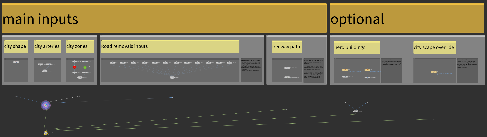
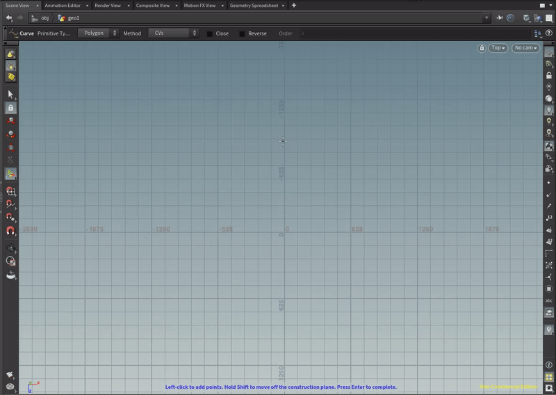
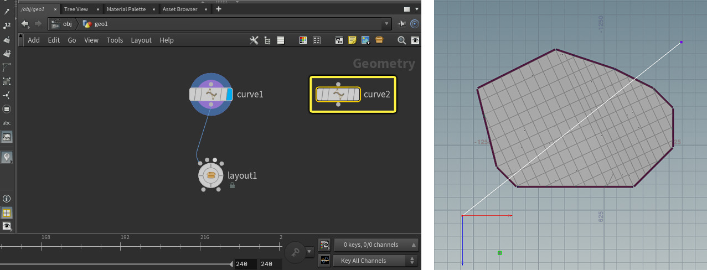
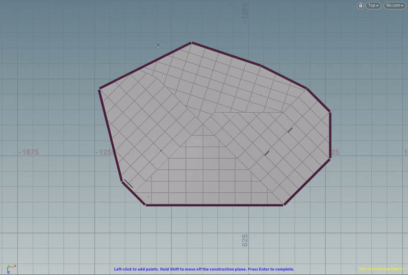

# City Sample Tutorial

## 官方教程
[Houdini 操作部分](https://docs.unrealengine.com/5.0/en-US/city-sample-quick-start-for-generating-a-city-and-freeway-using-houdini/)

下面以官方的 small city 为例，简述city sample 官方 quick start pipline 内容

### PIPLINE 总览
{width=50%}

主要输入项：
- city shape: 划定生成区域（规模和形状）
{width=50%}

- city arteries：使用曲线工具，划定城市主干道路
{width=50%}

- city zones: 划定多个城市部分区域（用于生成高楼）
{width=50%}

- road removals inputs: 删除指定的道路

- freeway path: 

### Hodini PIPLINE 输出文件

### PIPLINE 可调控参数

### Hodini PIPLINE 操作注意事项

### city sample 模块解析

[Unreal 操作部分](https://docs.unrealengine.com/5.0/en-US/city-sample-quick-start-for-generating-a-city-and-freeway-in-unreal-engine-5/#step6-runningthezonegraphgenerationfortraffic)