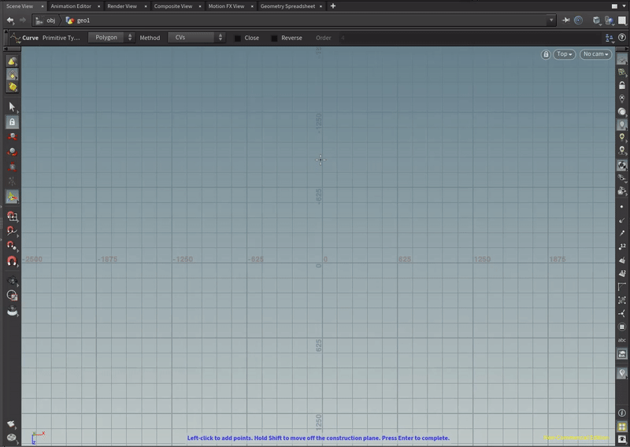

# City Sample Tutorial

## 官方教程
### [Houdini 操作部分](https://docs.unrealengine.com/5.0/en-US/city-sample-quick-start-for-generating-a-city-and-freeway-using-houdini/)

下面以官方的 small city 为例，简述city sample 官方 quick start pipline 内容

#### PIPLINE 总览
{width=50%}

主要输入项：
- city shape: 划定生成区域（规模和形状）
{width=50%}

- city arteries：使用曲线工具，划定城市主干道路
{width=50%}

- city zones: 划定多个城市部分区域（用于生成高楼）
{width=50%}

- road removals inputs: 删除指定的道路(非必要输入项)

- freeway path: 添加高速路段，目前高速路支持四车道和六车道
{width=50%}

#### Hodini PIPLINE 使用方式

- 非 PDG 模式：
    点击 "processor"：
    {width=50%}
- PDG 模式
    {width=50%}

- 输出文件:
    - PBC 文件：
    输出在 PBC 文件下，用于存储点云数据
    - bgeo 文件：
    输出在 "./EXPORT" 文件夹下， 表示点云的几何关系

#### PIPLINE 可调控参数
- City Layout 交通布局：
    城市密集度
    {width=70%}
    路网
    {width=70%}

- City Zone 楼房高度分布：
    {width=70%}

- Freeway:
    可通过画图工具增添高速路段
    {width=70%}

- Lots 区域：
    {width=70%}
    {width=70%}

#### Hodini PIPLINE 操作注意事项
- 环境变量：
    注意填写 win 地址("/"), 例如 "HOUDINI_PATH = D:/CitySampleSource/Small_City/houdini;&"

- houdini 版本选择：
    city sample 模块的python 代码是pytho2.7。推荐的 18.5.532 版本，已无法下载到，建议安装 "Houdini 19.0.720"，该版本也支持和 unreal 连接的插件，方便后续使用

- city sample 某些功能，需要付费版才能使用：
    - PBC 文件导出模块，只支持 FX 和 Core 版本的houdini 使用
    - houdini unreal plugin，只有Indie 以上的付费版可以使用
    - 建议使用虚拟机，在虚拟机内部使用破解版 houdini 软件，可以解决 PBC 文件导出问题。在本机付费使用 houdini Indie 版本，可以使用 houdini unreal plugin 

- 无法找到文件报错：
PDG 模式，由于hodini节点采用了多线程并行执行，后面的进程并未在前面进程完全结束后执行，有可能会遇到程序无法找到文件的问题。请在 "PDG process" 结束后，检查是否生成文件 "" 。运行 "process city furniture" 时，可能会报错 "unable find some files"，建议重复运行该项。

#### city sample 模块解析

### [Unreal 操作部分](https://docs.unrealengine.com/5.0/en-US/city-sample-quick-start-for-generating-a-city-and-freeway-in-unreal-engine-5/#step6-runningthezonegraphgenerationfortraffic)